  

<h1 align="center">Hi 👋, I'm Gautam Sikka</h1>
<h3 align="center">Full Stack Developer &amp; Data Analyst</h3>

  
  
  

---

### 🙋‍♂️ About Me

- 👨‍💻 All of my projects and work are showcased at [gautam1023.github.io/PORTFOLIO/](https://gautam1023.github.io/PORTFOLIO/)
- 💬 Ask me about **React, MongoDB, Power BI, Python &amp; Data Science**
- 📫 How to reach me: **gautamsikka2005@gmail.com**

---

### 💻 Technologies &amp; Tools

#### 💻 Frontend &amp; Mobile Development
*  **HTML5** &nbsp;—&nbsp; Web page structure and semantic design
*  **CSS3** &nbsp;—&nbsp; Visual styling and responsive layouts
*  **JavaScript** &nbsp;—&nbsp; Core programming logic and browser scripting
*  **ReactJS** &nbsp;—&nbsp; Modern single page app rendering
*  **Redux** &nbsp;—&nbsp; Global frontend application state management
*  **Flutter** &nbsp;—&nbsp; Cross-platform mobile development (iOS/Android)
*  **Tailwind CSS** &nbsp;—&nbsp; Utility-first styling framework
*  **CanvasJS** &nbsp;—&nbsp; Lightweight interactive data graphing
*  **Chart.js** &nbsp;—&nbsp; Simple yet flexible canvas data visualization

#### ⚙️ Backend &amp; Server Side
*  **Python** &nbsp;—&nbsp; Multi-paradigm scripting, automation, and statistical algorithms
*  **Node.js** &nbsp;—&nbsp; Scalable backend JavaScript execution runtime
*  **Express.js** &nbsp;—&nbsp; RESTful API server routing framework
*  **Flask** &nbsp;—&nbsp; Lightweight Python micro-web backend APIs

#### 📊 Data Science, Analytics &amp; Machine Learning
*  **Pandas** &nbsp;—&nbsp; High-performance data manipulation structures
*  **Seaborn** &nbsp;—&nbsp; Statistical charting and visuals
*  **OpenCV** &nbsp;—&nbsp; Advanced image processing and computer vision
*  **PyTorch** &nbsp;—&nbsp; Flexible deep learning tensor computing and neural nets
*  **TensorFlow** &nbsp;—&nbsp; Comprehensive machine learning model deployment and training

#### 🗄️ Databases, Cloud &amp; DevOps Infrastructure
*  **MongoDB** &nbsp;—&nbsp; High-performance document-oriented NoSQL storage
*  **MySQL** &nbsp;—&nbsp; Relational database storage querying
*  **PostgreSQL** &nbsp;—&nbsp; Extensible relational database engine
*  **Apache Hadoop** &nbsp;—&nbsp; Large-scale distributed big data framework
*  **Apache Kafka** &nbsp;—&nbsp; Real-time event streaming and pipeline processing
*  **Amazon Web Services (AWS)** &nbsp;—&nbsp; Enterprise cloud virtualization hosting &amp; scaling
*  **Docker** &nbsp;—&nbsp; Application container virtualization environment

---

### 📈 GitHub Contribution Activity

  

---

### 📊 Data Pipeline &amp; Analytics Monitor

  

